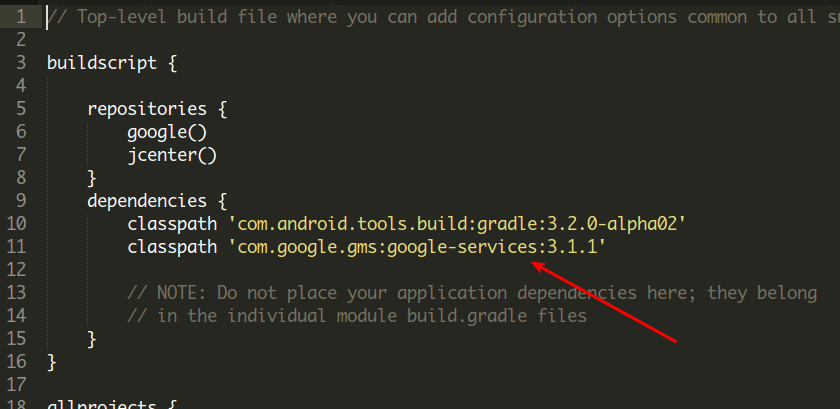
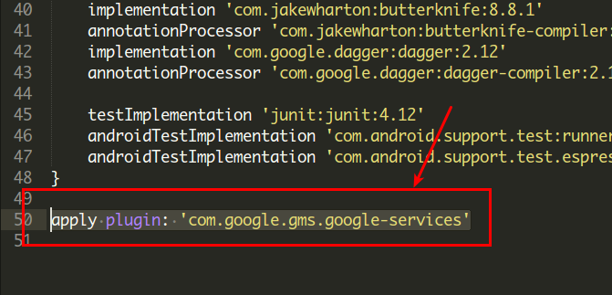
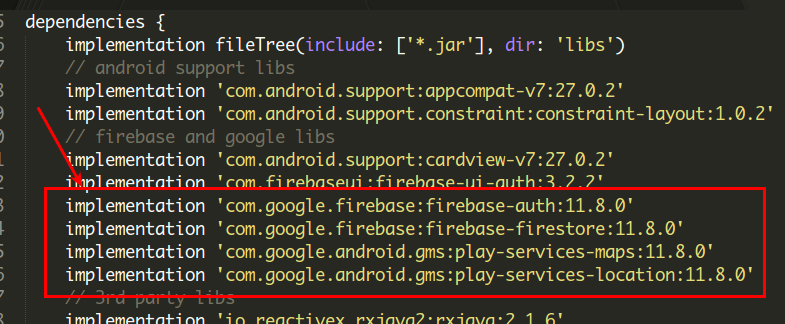
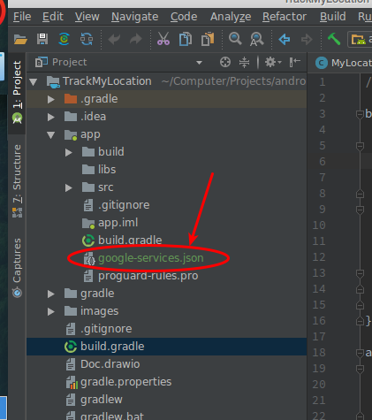
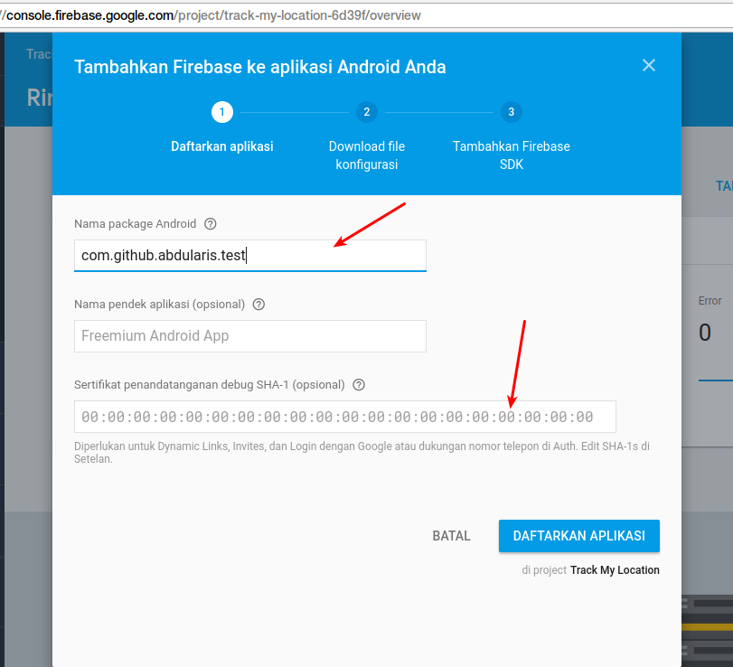
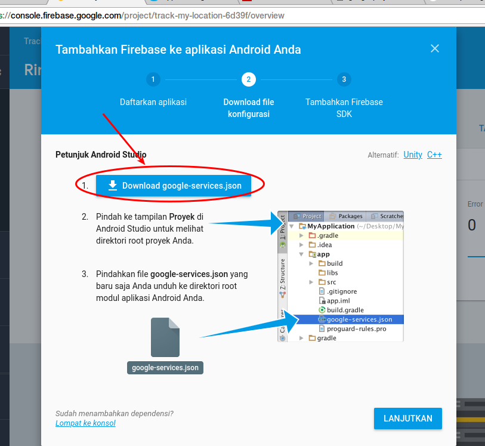
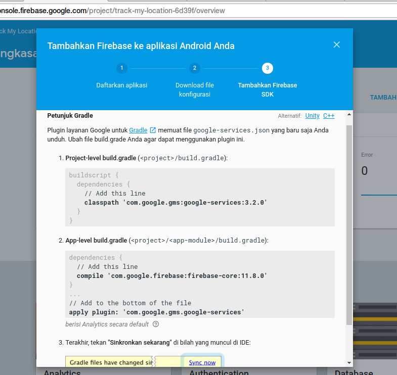

# Track My Location
This is a simple android app where you can brodcast your location and everyone who has your dynamically generated unique key can track you in near real-time.

I created this project just for learning puposes particularly about firebase (firestore db), google maps api and google location api.

***
### References
- [Set Up Google Play Services](https://developers.google.com/android/guides/setup)
- [Getting Started - Google Maps](https://developers.google.com/maps/documentation/android-api/start)
- [Get API Key](https://developers.google.com/maps/documentation/android-api/signup)
- [Add Marker in Maps](https://developers.google.com/maps/documentation/android-api/map-with-marker)
- Firebase Documentation (Guides) ([Link](https://firebase.google.com/docs/guides/))
- [Get Started with Firebase Firestore](https://firebase.google.com/docs/firestore/quickstart)
- [Firestore Data Model](https://firebase.google.com/docs/firestore/data-model)
- [Firestore - Get Data](https://firebase.google.com/docs/firestore/query-data/get-data)
- [Firestore - Structure Data](https://firebase.google.com/docs/firestore/manage-data/structure-data)


***
### Hot to integrate Google Maps & Location API
To use google maps in an android app you can use `SupportMapFragment` or `MapView`

- Using google maps fragment (inside a layout or as a root tag)
 
```xml
<fragment
	android:id="@+id/map"
	android:name="com.google.android.gms.maps.SupportMapFragment"
	android:layout_width="match_parent"
	android:layout_height="match_parent"/>
```

- Then you have to add permissions and google maps api key in the *AndroidManifest.xml* file


> Add permisions for coase and fine location also add meta-data tag for API key

***
### Integrate Google Play Services for Firebase into android project
- Add this gradle plugin `'com.google.gms:google-services:3.1.1'` into dependencies block of the top-level gradle build file



- Apply the google play services plugin in the app level gradle build file (app project)



- Then you can add google play services library for maps, location, places etc. (firebase needs google play services to operate)



- You need to download and add `google-services.json` file to your `project_name/app/` directory from firebase console when you add an android app to your firebase project
- Here are the complete figure





> enter the app package name & SHA-1 key (optional for firebase auth)







***
### Getting API Key for Google Maps & Location
- Go to the google cloud console page and click credentials submenu (or [Get API Key](https://developers.google.com/maps/documentation/android-api/signup) )


- Then create a new credential


- New API key has been created, you can copy the key and paste in the manifest file. To restrict access of the key click the restrict button


- You can restrict api key usage by selecting the platform or IP address by which the api call would be requested (Application restrictions)


1. Select one of the application restrictions (in this case Android)
2. Insert your android app package name
3. Insert SHA-1 fingerprint of your app
4. Click Save button

___
> - To get SHA-1 key you can use your android studo by opening your particular project -> select signingReport gradle task -> copy & paste the SHA-1 key into the android app restriction form


